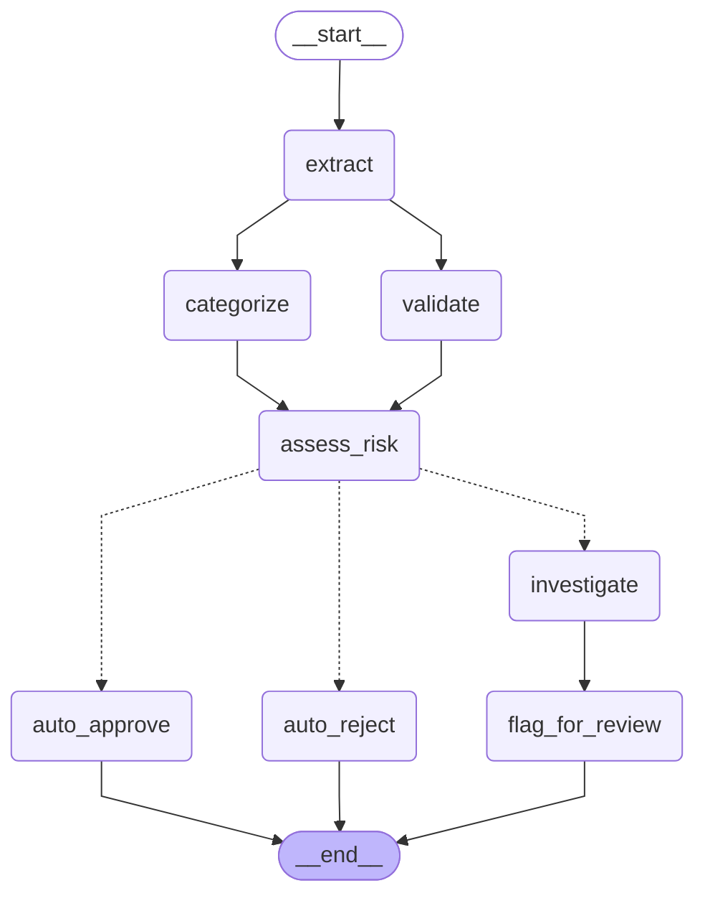
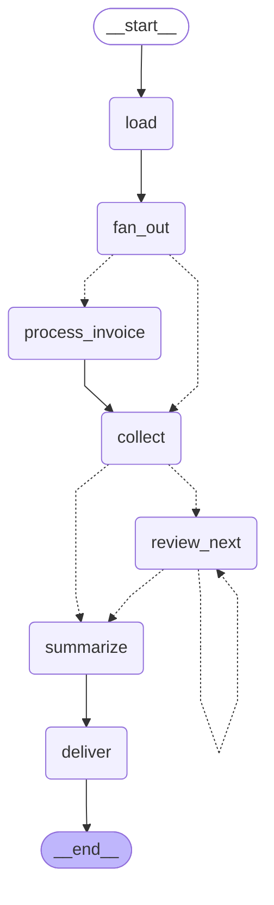

# lang-chain-app — an invoice pipeline built out of LangChain.js 1.x and LangGraph.js 1.x

A self-contained TypeScript project that makes up a batch of invoices, renders them as the kind of
messy documents a finance inbox actually receives (plain text, forwarded email, ASCII tables), injects
realistic defects into some of them, and then runs the whole batch through a LangGraph state machine:
extract → validate ∥ categorise → score the risk → investigate with a tool-calling agent → pause for a
human on anything risky → stream a prose summary → deliver to console, files and email. You see the raw
documents before, the processed table after, a delivery receipt per sink, and an evaluation against
ground truth the pipeline never saw. The design principle throughout: **the model extracts, categorises
and narrates; arithmetic, dates, vendor identity, duplicates and the approval policy are enforced by
deterministic code.** The LLM is never asked to add up a column or decide a threshold.

Every LangChain and LangGraph feature on show is load-bearing — used by a real step of the pipeline, not
by a toy snippet. The map from feature to file is in [`docs/FEATURES.md`](docs/FEATURES.md).

---

## Quickstart

```bash
npm install
npm run demo
```

That is the whole setup. **No API key, no network, no configuration.** The default provider is
`ScriptedChatModel` (`src/llm/fake-model.ts`) — and to be blunt about what that is: it is a
**deterministic, rule-based model, not an LLM**. It parses the invoice text with regexes, picks a
category from keyword rules, and fills a summary template. What makes it useful is that it is a genuine
`BaseChatModel` subclass, so `withStructuredOutput`, `bindTools`, caching, streaming, retries, fallbacks
and the agent loop all run through the real LangChain code paths — the same code that runs against
Claude. Its answers are canned; everything around them is not.

`npm run demo` generates 8 invoices at a fresh time-derived seed (defect rate 0.35), runs them, and
auto-approves anything that reaches the review queue. The seed it picked is printed — pass it back with
`--seed <n>` to reproduce the exact batch. What you will see, in order:

1. **Raw preview** — a table of the 8 generated documents (id, format, size, first line), then the
   ground-truth table, which is printed for you and never shown to the pipeline.
2. **Live progress** — `▶ extract doc-001` / `✓ validate doc-001 (2 ms)` / `→ doc-004 needs_review: …`,
   demultiplexed from LangGraph's `updates` and `custom` stream channels.
3. **The streamed summary** — the summarise node's tokens arriving one at a time via `streamMode:
   "messages"`.
4. **The processed table** — invoice, vendor, total, category, risk, decision, issue codes.
5. **Delivery receipts** — one line per sink (`✓ console`, `✓ file …`), with the artefacts it wrote.
6. **Evaluation** — extraction field accuracy and injected-defect recall against the manifest's
   ground truth.

Artefacts land under `out/<batchId>/`: `manifest.json`, `raw/*.txt`, `processed/results.json`,
`processed/results.csv`, `report.html`, `report.md`. The payment ledger is `out/ledger.json`.

> **The ledger persists across runs.** `out/ledger.json` keeps every invoice the pipeline has already
> decided on, and the next batch is checked against it. An **exact** duplicate — the same invoice number
> *from the same vendor* — is `auto_rejected` with an error-severity `DUPLICATE_IN_LEDGER`. The same
> number from a *different* vendor is only a warning and goes to the review queue, because that is a
> numbering collision, not a second payment.
>
> `generate` and `demo` default to a **time-derived seed**, so consecutive runs invent fresh invoices and
> nothing is rejected as a duplicate. Pin the seed (`--seed 42`) to reproduce a batch — and run the same
> seed twice to watch the duplicate check fire on the second run. Delete `out/ledger.json` (or point
> `--out` somewhere fresh) to reset the history.

---

## Using real Claude

Two environment variables and no code change:

```bash
LLM_PROVIDER=anthropic
ANTHROPIC_API_KEY=sk-ant-...
ANTHROPIC_MODEL=claude-opus-5      # optional; this is the default
```

Or per run: `npm run cli -- run <batchId> --provider anthropic --model claude-opus-5`.
Copy `.env.example` to `.env` and it is picked up automatically (`src/config.ts:loadConfig`).
`LLM_PROVIDER=anthropic` without a key is rejected at config-parse time with a clear message rather than
failing halfway through a batch — except for `generate`, `preview` and `evaluate`, which never call a
model and pass `requireModelCredentials: false` so a key-less `.env` cannot stop them.

**No `maxTokens` cap.** `createModels` leaves `maxTokens` to `@langchain/anthropic`'s own default
(`src/llm/factory.ts`). Opus 5 has adaptive thinking on by default, and a low cap would spend the budget
on thinking and truncate the response before the extraction tool call is emitted — which the pipeline
would see as "no tool call" and quietly resolve through the fallback. Set it explicitly only if you have
a reason to.

**Cost — an estimate, not a quote.** `claude-opus-5` lists at **$5 / MTok input and $25 / MTok output**
(`src/llm/pricing.ts`). One 10-invoice batch at the default defect rate is **27 model calls** — measured,
`--seed 42`: 10 extractions + 10 categorisations + 2 turns for each of the 3 investigated invoices + 1
summary. The offline model counted ≈10.2k input and ≈3.1k output tokens for that batch; against the real
API expect more on both sides (tool JSON schemas ride along on every call, and Opus 5 has adaptive
thinking on by default). Budget on the order of **$0.10–$0.50 per 10-invoice batch**, and more if
`--chaos` or a flaky network makes retries fire. The run footer prints the real number: a per-model table
of calls, tokens and estimated USD, from the `UsageTracker` callback handler.

**Graceful degradation.** With the Anthropic provider the deterministic model is wired in as a
*fallback*, not a replacement (`src/llm/factory.ts:createModels`). The extraction and categorisation
chains run through `resilient()`: `withRetry` up to `LLM_MAX_RETRIES` attempts on retryable errors, then
`withFallbacks` to the scripted model. The summary streams, so it cannot go through `resilient()` — it
runs the same retry-then-fallback ladder itself in `src/graph/batch.graph.ts:writeSummary`. "Retryable"
means 408/409/429/5xx, the Anthropic SDK's `APIConnectionError` / `APIConnectionTimeoutError`, and raw
socket failures (`ECONNRESET`, `ETIMEDOUT`, `ECONNREFUSED`, `EAI_AGAIN`) whether they arrive on the error
or on its `cause` (`src/llm/errors.ts:isRetryableError`). When that happens it is never silent — a warning is logged (`[llm] primary failed,
falling back to fake: …`), and the result carries `provider: "fake"` all the way into
`processed/results.json` and the report, so you can always tell which invoices the real model handled.

`claude-sonnet-5` ($3 / $15) and `claude-haiku-4-5` ($1 / $5) are also priced in `src/llm/pricing.ts` and
work via `--model`, if you want a cheaper run for experimentation. Opus 5 stays the default.

---

## Email delivery

The email sink only runs when there is a recipient — `--email you@example.com` or `EMAIL_TO` in `.env`.
It sends the HTML report as the body, the Markdown report as the text part, and attaches
`results.json` + `results.csv`. Three modes, tried in order (`src/sinks/email.ts:resolveTransport`):

| Mode | How to get it | What happens |
| --- | --- | --- |
| **Ethereal (zero-config)** | just `--email <to>`, no SMTP vars | A throwaway Ethereal test inbox is created on the fly; the receipt prints a **preview URL** you can open in a browser. Nothing is delivered to the real address. |
| **Your own SMTP** | `SMTP_HOST`, `SMTP_PORT`, `SMTP_USER`, `SMTP_PASS`, `SMTP_SECURE` | Sent for real; the receipt carries the message id. |
| **Resend** | `SMTP_HOST=smtp.resend.com`, `SMTP_PORT=587`, `SMTP_USER=resend`, `SMTP_PASS=<your Resend API key>` | Resend speaks SMTP, so no extra SDK. Same path as any other SMTP host. |

If Ethereal cannot be reached (offline, firewall), the sink falls back to nodemailer's `jsonTransport`
and writes the serialised message to `out/<batchId>/email.json` — logged as a warning, and the receipt
says `offline: message written to …`. **A sink never throws.** Every outcome is a `DeliveryReceipt`
(`{ sink, ok, detail, at }`) that is stored in graph state, printed under "Deliveries", and a failed
receipt makes the CLI exit non-zero.

---

## CLI reference

`npm run cli -- <command>` runs any of these; the shortcuts in `package.json` are listed in the last
column. Every command except `graph` accepts `--out <dir>` (default `OUT_DIR`, else `./out`).

| Command | Options | What it does | Shortcut |
| --- | --- | --- | --- |
| `generate` | `-n, --count <n>` (10) · `--seed <n>` (time-derived) · `--defect-rate <r>` (0.35) · `--batch-id <id>` · `--out <dir>` | Generates a seeded batch, writes it to disk, prints the raw-document table and the ground-truth table. | `npm run generate` |
| `preview <batchId>` | `--show <docId>` · `--ground-truth` · `--out <dir>` | Re-prints an existing batch. `--show` dumps one document's full text; `--ground-truth` adds the truth table. | `npm run preview` |
| `run <batchId>` | `--provider fake\|anthropic` · `--model <id>` · `--review interactive\|approve\|reject` · `--email <to>` · `--chaos <rate>` · `--checkpointer memory\|sqlite` · `--concurrency <n>` · `--out <dir>` | Processes the batch end to end and delivers it. `--review` defaults to `interactive` on a TTY and `approve` otherwise. `--chaos` sets the fake model's failure rate (0..1) to exercise retries. | `npm run run:batch` |
| `resume <threadId>` | `--decision approve\|reject` (**required**) · `--note <text>` · `--checkpointer memory\|sqlite` · `--review …` · `--provider …` · `--email <to>` · `--concurrency <n>` · `--out <dir>` | Answers the review a previous *process* left pending on that thread and finishes the batch. Requires `--checkpointer sqlite`; refuses with a clear error otherwise. Thread id = batch id. | `npm run resume` |
| `evaluate <batchId>` | `--out <dir>` | Scores `processed/results.json` against the manifest's ground truth: per-field extraction accuracy, per-defect recall, and which documents hid a defect. | `npm run evaluate` |
| `graph` | `--which invoice\|batch\|both` (both) | Prints the compiled graphs as Mermaid, straight from LangGraph's `drawMermaid()`. | `npm run graph` |
| `demo` | `-n, --count <n>` (8) · `--seed <n>` (time-derived) · `--defect-rate <r>` (0.35) · plus every `run` option | `generate` → `run` → `evaluate` in one command, then a numbered "what just happened" recap. Defaults `--review approve` so it never blocks. | `npm run demo` |

Options passed on the command line beat `.env`, which beats the built-in defaults.

### The resume flow

`resume` demonstrates that a LangGraph `interrupt()` outlives the process that created it — the pause
lives in the checkpointer, not in memory.

```bash
# 1. Run with a durable checkpointer and a human in the loop.
npm run cli -- run <batchId> --checkpointer sqlite --review interactive
#    Answer the first invoice, then Ctrl-C (or close stdin). The graph is parked mid-review;
#    state and the pending interrupt sit in out/checkpoints.sqlite.

# 2. From a completely new process, answer it and let the batch finish.
npm run resume -- <batchId> --decision reject --note "vendor not approved" --checkpointer sqlite
```

`resumeBatch` (`src/pipeline/run-batch.ts`) reads the pending interrupt via `graph.getState()` →
`snapshot.tasks[].interrupts[]`, refuses if there is nothing to answer, then streams the graph forward
with `new Command({ resume: decision })`. Anything still in the queue after that is handled by
`--review` as usual.

---

## Architecture

Both diagrams below are the literal output of `npm run graph` — LangGraph draws them from the compiled
graphs, so they cannot drift from the code.

### Invoice subgraph — one run per document



Node by node (`src/graph/invoice.graph.ts`):

- **`extract`** — LCEL chain: `ChatPromptTemplate` → `model.withStructuredOutput(ExtractedInvoiceSchema)`
  → a `RunnableLambda` that re-`parse`s the result (core's structured output does *not* validate). The
  prompt tells the model to copy figures verbatim and never recompute. A total failure becomes a typed
  `EXTRACTION_FAILED` issue and `auto_rejected` — the node never throws, so one bad document cannot take
  the batch down. It also declares a node-level `retryPolicy` (see the caveats).
- **`validate` ∥ `categorize`** — two edges leave `extract`, so LangGraph runs these **in parallel**.
  `validate` is pure deterministic code: `checkTotals`, `checkDates`, `checkVendor`,
  `checkLedgerDuplicates`. `categorize` is a few-shot LCEL chain seeded with the vendor registry's
  default category, and contributes a `MISSING_FIELD` warning if its model call fails. Both branches
  write `issues` and `timings` in the same superstep (and `assess_risk` appends more issues after them),
  which is why those two channels are **reducers** — with last-value-wins channels one branch would
  clobber the other.
- **`assess_risk`** — applies the approval policy (`checkPolicy`), scores the risk deterministically
  (errors +35, warnings +12, unknown vendor +20, over-threshold +25, capped at 100 → low/medium/high),
  and pulls the two best-matching passages out of the BM25 policy retriever to hand to the reviewer. Two
  floors keep the score honest: any issue the handbook says a human must see (`DUPLICATE_IN_LEDGER`,
  `MISSING_PO`, `OVER_REVIEW_THRESHOLD`, `OVER_CFO_THRESHOLD`, `UNKNOWN_VENDOR`), or any two warnings at
  once, lifts the score to at least `medium` — and a gated code adds a reason naming the policy rule.
- **route (`routeAfterRisk`)** — a conditional edge: nothing extracted, or an *error*-severity
  `DUPLICATE_IN_LEDGER` (same invoice number **and** same vendor) → `auto_reject`; any of the five
  review-gated codes above, at any severity → `investigate`; otherwise risk not `low` → `investigate`,
  and `auto_approve` only when the invoice is genuinely clean. So a near-duplicate, a re-used number from
  another vendor, and a missing PO all reach a human instead of being auto-approved, exactly as the
  handbook says. `tests/graph/routing.test.ts` pins each of those cases against a handbook sentence.
- **`investigate`** — a `createAgent` ReAct loop with the four deterministic tools
  (`recompute_totals`, `lookup_vendor`, `find_duplicates`, `search_policy`), a tool-call limit and retry
  middleware, and a `toolStrategy` structured response. It verifies every claim with a tool and never
  approves on missing evidence. → `flag_for_review`.
- **`auto_approve` / `auto_reject` / `flag_for_review`** — terminal nodes that stamp the decision and
  announce it on the progress stream.

Every node in this subgraph runs inside `timed()` (`src/graph/instrument.ts`), which emits
`node_start`/`node_end` on the custom stream and folds the node's duration into the `timings` map. The
batch graph's nodes use the same helper without the timings, `traced()` — except `review_next`, which is
deliberately left bare because `interrupt()` throws and a `finally` would print "node finished" on every
pause.

### Batch graph — fan out, review, summarise, deliver



Node by node (`src/graph/batch.graph.ts`):

- **`load`** — stamps `startedAt` and announces the workload.
- **`fan_out`** — the **map** half of map-reduce. `fanOutRouter` returns one
  `new Send("process_invoice", { document })` per document; an empty batch short-circuits to `collect`.
  `maxConcurrency` (from `--concurrency`, default 4) throttles how many run at once.
- **`process_invoice`** — declared with `{ input: ProcessInvoiceInput }`, a *different, narrower* state
  schema than the batch state, because `Send` delivers a custom payload. It invokes the compiled invoice
  subgraph and passes the parent `config` through, so the subgraph inherits the context, the stream
  writer and the callbacks. The **reduce** half is the `results` channel's `upsertResults` reducer, which
  merges by `documentId` — that is what lets a later human decision *replace* a fanned-in row instead of
  appending a duplicate.
- **`collect`** — the fan-in. Cross-document duplicate detection has to happen here (no single invoice
  can see its siblings): the first document id wins, later ones get `DUPLICATE_IN_BATCH` and
  `auto_rejected`. Then it recomputes the stats and builds `reviewQueue`.
- **`review_next`** — the human-in-the-loop **cycle**. It pops one document, builds a `ReviewRequest`
  (risk, issues, the investigator's brief, the policy excerpts) and calls `interrupt()`. The resume value
  is validated with zod; an invalid payload **interrupts again** from the same node with an `error`
  explaining what was wrong, up to 3 times, after which the invoice is left `needs_review` with a note
  rather than hanging the run. A conditional edge loops the node back to itself until the queue is empty.
- **`summarize`** — streams the summary chain directly (`.stream()`, tokens visible via `streamMode:
  "messages"`) and falls back to the secondary provider before it will give up on a sentence of prose.
- **`deliver`** — every sink under `Promise.allSettled`; each outcome becomes a receipt in state, so no
  delivery failure is silent.

**Runtime dependency injection.** Nothing above reaches for a global. Models, tools, the ledger, the
retriever, the policy, the sinks and the logger travel in LangGraph's `context`
(`src/pipeline/context.ts:PipelineContextSchema`, read as `config.context` in every node). Context is
deliberately *not* checkpointed, which is what makes it safe to put live objects in it.

---

## Sample output

Real output of `npm run demo -- -n 8 --seed 42 --review approve` into an empty output directory. `…`
marks where lines were cut, the tables' inter-row separators were removed, and the summary (one very long
line on screen) is wrapped. Nothing else is edited.

```
Raw documents — batch batch-20260820-121222-42 (8 document(s))
┌───┬─────────┬────────┬───────┬──────────────────────────────────────────────┐
│ # │ id      │ format │ chars │ first line                                   │
├───┼─────────┼────────┼───────┼──────────────────────────────────────────────┤
│ 1 │ doc-001 │ email  │   620 │ From: billing@paperclip.example              │
│ 2 │ doc-002 │ table  │  1235 │ +------------------------------------------… │
│ 3 │ doc-003 │ plain  │   568 │ INVOICE                                      │
…
Ground truth (truth — never shown to the pipeline)
│ doc-003 │ INV-2026-49106 │ Quantum Analytics Corp     │   714.50 │ USD      │ MATH_MISMATCH                │
│ doc-006 │ INV-2026-49123 │ Northwind Software LLC     │ 3,570.38 │ USD      │ MISSING_PO, MISSING_DUE_DATE │
…
INFO  seed 42 — pass --seed 42 to reproduce this batch
INFO  batch batch-20260820-121222-42: 8 document(s) · provider fake · review approve
INFO  ▶ extract doc-001
INFO  ✓ extract doc-001 (20 ms)
INFO  ▶ categorize doc-001
INFO  ▶ validate doc-001
INFO  → doc-001 auto_approved: no blocking issues
…
INFO  ▶ investigate doc-003
INFO  ✓ investigate doc-003 (64 ms)
INFO  → doc-003 needs_review: Subtotal plus tax is 678.50 but the printed total is 714.50
…
INFO  ▶ investigate doc-006
INFO  ✓ investigate doc-006 (35 ms)
INFO  → doc-006 needs_review: No due date was found on the invoice
INFO  ▶ collect
INFO  ⏸ waiting for human review
INFO  ⏸ review doc-003 (1 left in the queue)
INFO  → doc-003 approved_by_human: auto-approve (non-interactive run)
INFO  ⏸ waiting for human review
INFO  ⏸ review doc-006 (0 left in the queue)
INFO  → doc-006 approved_by_human: auto-approve (non-interactive run)
INFO  ▶ summarize
Processed 8 invoices worth USD 18,661.47 in total. 6 were auto-approved and 2 were approved by a
reviewer, releasing USD 18,661.47 for payment. 0 were rejected and 0 are still waiting on review. The
most frequent issue was TOTAL_MISMATCH (1 occurrence). PROFESSIONAL_SERVICES was the largest spend
category with 3 invoices.

Batch batch-20260820-121222-42 — 8 invoice(s), provider fake
┌───┬────────────────┬──────────────────────────┬──────────────┬───────────────────────┬───────────┬───────────────────┬──────────────────────────┐
│ # │ Invoice        │ Vendor                   │ Total        │ Category              │ Risk      │ Decision          │ Issues                   │
├───┼────────────────┼──────────────────────────┼──────────────┼───────────────────────┼───────────┼───────────────────┼──────────────────────────┤
│ 1 │ INV-2026-49089 │ Paperclip Office Supply… │ 2,801.03 USD │ OFFICE_SUPPLIES       │ low 0     │ auto_approved     │ —                        │
│ 3 │ INV-2026-49106 │ Quantum Analytics Corp   │ 714.50 USD   │ SOFTWARE              │ medium 35 │ approved_by_human │ TOTAL_MISMATCH           │
│ 6 │ INV-2026-49123 │ Northwind Software LLC   │ 3,570.38 USD │ SOFTWARE              │ medium 25 │ approved_by_human │ MISSING_DUE_DATE, MISSI… │
└───┴────────────────┴──────────────────────────┴──────────────┴───────────────────────┴───────────┴───────────────────┴──────────────────────────┘
Auto-approved 6 · Approved by human 2 · Auto-rejected 0 · Rejected by human 0 · Needs review 0 · Approved USD 18,661.47 of USD 18,661.47

Deliveries
  ✓ console — printed 8 invoice(s)
  ✓ file — processed/results.json, processed/results.csv, report.html, report.md

LLM usage
┌───────────────────┬───────┬──────┬──────┬──────────┐
│ Model             │ Calls │   In │  Out │ Cost USD │
├───────────────────┼───────┼──────┼──────┼──────────┤
│ ScriptedChatModel │    21 │ 7737 │ 2419 │   0.0000 │
│ TOTAL             │    21 │ 7737 │ 2419 │   0.0000 │
└───────────────────┴───────┴──────┴──────┴──────────┘
8 tool call(s): recompute_totals, lookup_vendor, find_duplicates, search_policy · 0 LLM error(s) · 56 ms in models

10 checkpoint(s) on thread batch-20260820-121222-42

Evaluation — batch batch-20260820-121222-42  …
Field accuracy: 100.0%
Defect recall: 100.0%
No injected defect was missed.
```

100% is what a rule-based parser reading its own renderer's output looks like. Against real Claude those
numbers are the interesting part, not a formality.

---

## Project layout

| Path | What lives there |
| --- | --- |
| `src/cli.ts`, `src/cli/` | commander wiring; `commands.ts` (one function per command), `preview.ts` (raw/ground-truth tables), `reviewers.ts` (interactive stdin reviewer + auto reviewers). |
| `src/domain/` | The contract: `schemas.ts` (every zod entity), `policy.ts` (typed approval rules **and** the Markdown handbook rendered from them), `vendors.ts` (a 12-vendor registry + alias/suffix-tolerant matching), `constants.ts` (tool names and prompt markers shared by prompts, tools and the fake model). |
| `src/data/` | Batch generation: `rng.ts` (seeded mulberry32), `generator.ts`, `defects.ts` (the 9 injectable defects), `renderers.ts` (plain / email / table layouts), `batch-store.ts` (on-disk batches), `ledger.ts` (JSON payment ledger for cross-batch duplicates). |
| `src/llm/` | `factory.ts` (`createModels`, `resilient`), `fake-model.ts` (`ScriptedChatModel`), `responders/` (the rule-based responders it routes to), `text-parser.ts` (inverse of the renderers), `pricing.ts`, `errors.ts`. |
| `src/chains/` | The three LCEL chains: `extract.ts`, `categorize.ts` (few-shot), `summarize.ts` (streaming). |
| `src/tools/` | The four agent tools plus `checks.ts`, the pure deterministic validators the `validate` node also uses. |
| `src/rag/` | `policy-retriever.ts` — a BM25 `BaseRetriever` over the rendered policy handbook. |
| `src/agents/` | `investigator.ts` — the `createAgent` tool-calling investigator. |
| `src/graph/` | `state.ts` (state schemas + reducers), `invoice.graph.ts`, `batch.graph.ts`, `checkpointer.ts`, `instrument.ts` (progress events + node timing). |
| `src/pipeline/` | `context.ts` (the LangGraph context schema and its construction), `run-batch.ts` (`runBatch` / `resumeBatch` / `autoReviewer`), `stats.ts`, `types.ts`. |
| `src/sinks/`, `src/report/` | Delivery targets (console, file, email) and the renderers they share (`csv.ts`, `html.ts`, `markdown.ts`, `format.ts`). |
| `src/observability/` | `usage-tracker.ts` (a `BaseCallbackHandler`), `progress.ts` (the live stream printer), `logger.ts`. |
| `src/evaluate/` | `evaluate.ts` — processed vs ground truth, field accuracy and defect recall. |
| `examples/` | Four standalone scripts for features that do not sit naturally in the pipeline. |
| `tests/` | Vitest suite mirroring `src/`, plus shared fixtures. |
| `docs/` | [`FEATURES.md`](docs/FEATURES.md) and the design spec / plan under `docs/superpowers/`. |

---

## Testing

```bash
npm test          # 310 tests across 28 files (vitest)
npm run typecheck # tsc --noEmit, strict + noUncheckedIndexedAccess
```

What is covered: generator determinism and defect injection · renderer ↔ parser round trips, including a
30-seed seam test that re-parses every generated document and asserts a clean invoice raises **no** check
issue (`tests/data/roundtrip.test.ts`) · the fake model's structured-output, agent and fault-injection
paths · every tool and every deterministic check, including all three ledger-duplicate branches (same
number + same vendor, same number + other vendor, near duplicate) · each of the three chains, including
their failure paths · `routeAfterRisk` / `scoreRisk` pinned against the handbook's own sentences
(`tests/graph/routing.test.ts`) · which errors count as retryable, built from real Anthropic SDK error
objects (`tests/llm/errors.test.ts`) · invoice-graph routing per defect kind · the batch graph's
interrupt → resume cycle (approve, reject, two flagged in a row, an invalid resume payload that
re-interrupts, and giving up after repeated bad payloads) · the summary's retry-then-fallback ladder ·
the reducers · `resumeBatch` answering a pause a previous run left behind · sinks (file artefacts; email
through an injected transport) · the stats, the report renderers (including CSV formula-injection
escaping), the progress printer, the usage tracker, and the evaluation metrics.

**No test touches the network.** Everything runs on the `fake` provider; `nodemailer` is mocked so that
Ethereal always fails and every SMTP transport collapses to an in-memory `jsonTransport`; file tests use
`fs.mkdtemp` temp directories. `ChatAnthropic` appears in exactly two test files: once to assert the
factory constructed the right class, and once as a fake `Serialized` id fed to the callback handler.
`tests/llm/errors.test.ts` constructs `@anthropic-ai/sdk` error objects directly. None of them calls the
API.

---

## Honest caveats

Things that are true about this code and would be easy to overclaim:

- **The default model is rule-based, not an LLM.** `ScriptedChatModel` parses documents with regexes and
  fills templates. It exists so the demo runs offline and the tests are deterministic. Perfect extraction
  accuracy in an offline run means the parser is the inverse of the renderer — nothing more. Set
  `LLM_PROVIDER=anthropic` for a real measurement.
- **`resilient()` cannot stream.** Not because of `withRetry` — the blocker is the notifying
  `RunnableLambda` that `resilient()` wraps the primary branch in (`src/llm/factory.ts`) so it can log
  the fallback. A `RunnableLambda` built from an `async` function has no streaming path of its own: it
  runs to completion and yields one value. So the summarise node deliberately calls
  `buildSummaryChain(model).stream(...)` directly and re-implements retry + fallback around it
  (`writeSummary`). Streaming *inside* a node with `streamMode: "messages"` still works normally.
- **A `ZodError` in a chain also triggers the provider fallback.** `withFallbacks` catches *any* error,
  and the chains re-`parse` the model's structured output, so a schema violation from the primary is
  retried on the fallback rather than failing outright. That is deliberate — a malformed answer is a
  provider problem worth a second opinion — but it means "fell back" does not always mean "the API was
  down".
- **The `retryPolicy` on the `extract` node is a demonstration, not a live safety net.** `resilient()`
  already retries inside the node, and the node catches everything and returns a typed issue, so nothing
  normally escapes for LangGraph to retry. It is declared (and commented as such in
  `src/graph/invoice.graph.ts`) because node-level retry policies are part of what this project is
  showing. `examples/retry-fallback.ts` has a graph where the policy really does fire.
- **`BatchResult.provider` is the primary provider's tag, always.** It is stamped from
  `context.models.primaryTag` even if the summary actually came from the fallback — the batch state has
  no channel for the summary's provider, so a summary fallback shows up only in the log and as a `warn`
  progress event. The *per-invoice* `provider` field is accurate for extraction, which is the call it is
  recorded from; the categorisation call's provider is not separately recorded.
- **The `checkpoints` count is the root namespace only.** `getStateHistory` on the batch thread does not
  include the per-invoice subgraph namespaces, so the number in the footer is "checkpoints you could
  rewind to on this thread", not "every checkpoint written".
- **Mixed currencies are summed as printed.** `BatchStats` totals are currency-blind. When a batch
  contains more than one currency the renderers drop the currency prefix and append
  `(mixed currencies: USD, EUR — summed as printed)` rather than pretending a conversion happened. The
  generator's `FOREIGN_CURRENCY` defect makes this easy to see.
- **Two identical prompts cost one model call.** Both providers get an `InMemoryCache`, so "N documents
  ⇒ N calls" is an upper bound, not a law: two documents that render to the same text are one model call.
  The generator does not normally produce that — `DUPLICATE_NUMBER` copies only the invoice number and
  the vendor from an earlier invoice (`src/data/defects.ts:applyDefect`), leaving the amounts, dates and
  line items different — so in practice the cache bites when the *same* document is processed twice, or
  in the categorisation step where different invoices from one vendor can produce the same prompt. Token
  and cost accounting under-count on a cache hit.
- **`resume` assumes `threadId === batchId`.** That is how `run` creates threads, but a run started with
  a custom thread id (which `runBatch` supports) cannot be resumed from the CLI.
- **With the `fake` provider there is no fallback to fall back *to*.** `createModels` sets
  `fallback: null`, so a high `--chaos` rate that survives all `LLM_MAX_RETRIES` summary attempts yields
  `Summary unavailable: …` in the report. That is the one place where chaos visibly degrades output
  instead of being absorbed.

---

## Examples

Four standalone scripts, each offline and each printing labelled output:

| Command | What it shows |
| --- | --- |
| `npm run example:lcel` | LCEL composition end to end: `prompt \| model \| StringOutputParser`, `RunnableParallel` running categorisation and summarisation over one shared input, `.batch()` over three inputs with `maxConcurrency: 2`, and `withConfig({ runName, tags })` — printing the run name it observed plus which child runs the tags actually reached. |
| `npm run example:streaming` | Three levels of streaming: `.stream()` yielding 50 parser chunks, `streamEvents({ version: "v2" })` with a tally of every runnable lifecycle event (`on_chat_model_stream`, `on_parser_stream`, …), and a LangGraph run with `streamMode: ["updates", "custom"]` over the real invoice subgraph. |
| `npm run example:resilience` | The two resilience layers: `resilient()` retrying a 70%-failure primary and then falling back (with a deliberately dead primary at the end so the fallback always fires), and a one-node graph whose `retryPolicy` re-runs a node that throws twice. |
| `npm run example:time-travel` | Checkpointing as a time machine: run a batch, walk `getStateHistory()` newest-first, rewind to the checkpoint `collect` produced, `updateState()` a decision at that point, then `invoke(null, forked)` to replay `summarize` and `deliver` from the fork. |

---

## Further reading

- **[`docs/FEATURES.md`](docs/FEATURES.md)** — the feature map: every LangChain and LangGraph capability
  used here, with the file and symbol that uses it and what to look at.
- **[`docs/superpowers/specs/2026-08-20-invoice-pipeline-design.md`](docs/superpowers/specs/2026-08-20-invoice-pipeline-design.md)**
  — the design spec: domain model, the defect table, error-handling rules, and the assumptions that were
  made autonomously.
- **[`docs/superpowers/plans/2026-08-20-invoice-pipeline-plan.md`](docs/superpowers/plans/2026-08-20-invoice-pipeline-plan.md)**
  — the implementation plan the code was built from.
- `.env.example` — every environment variable, with comments.
